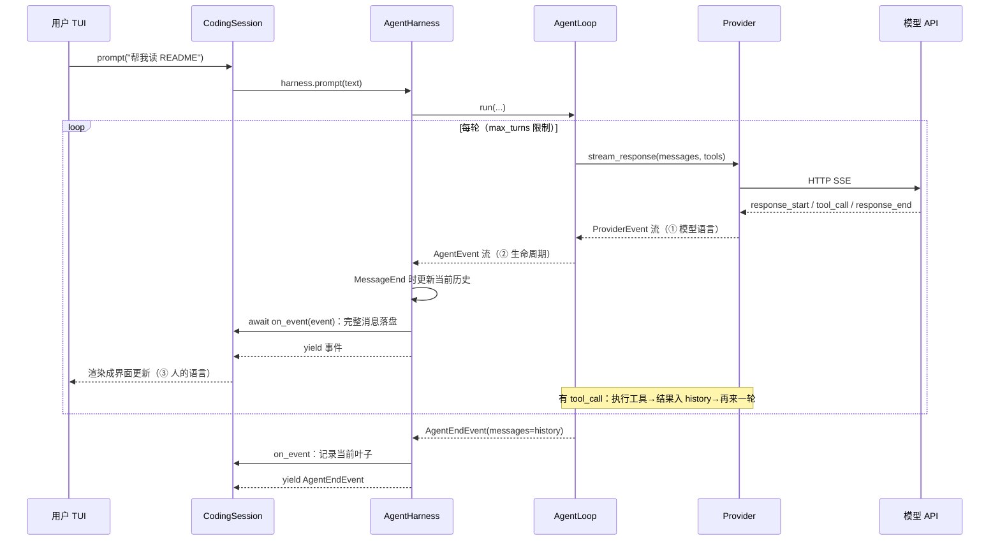
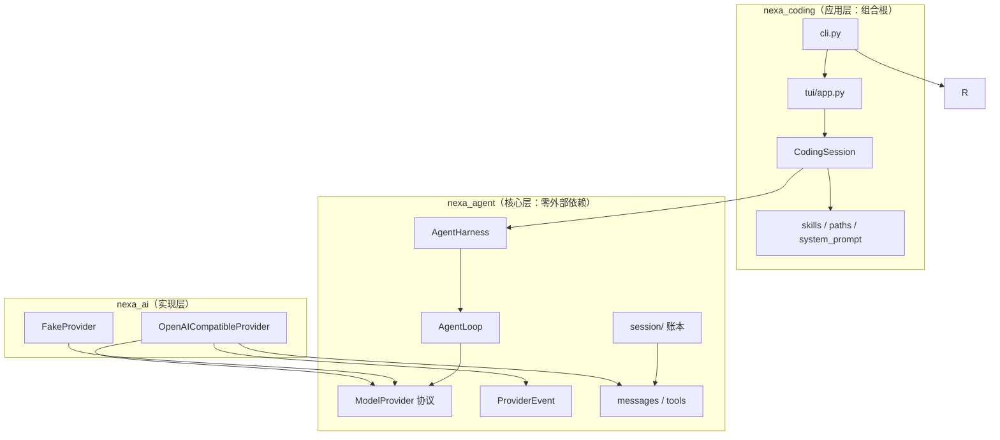
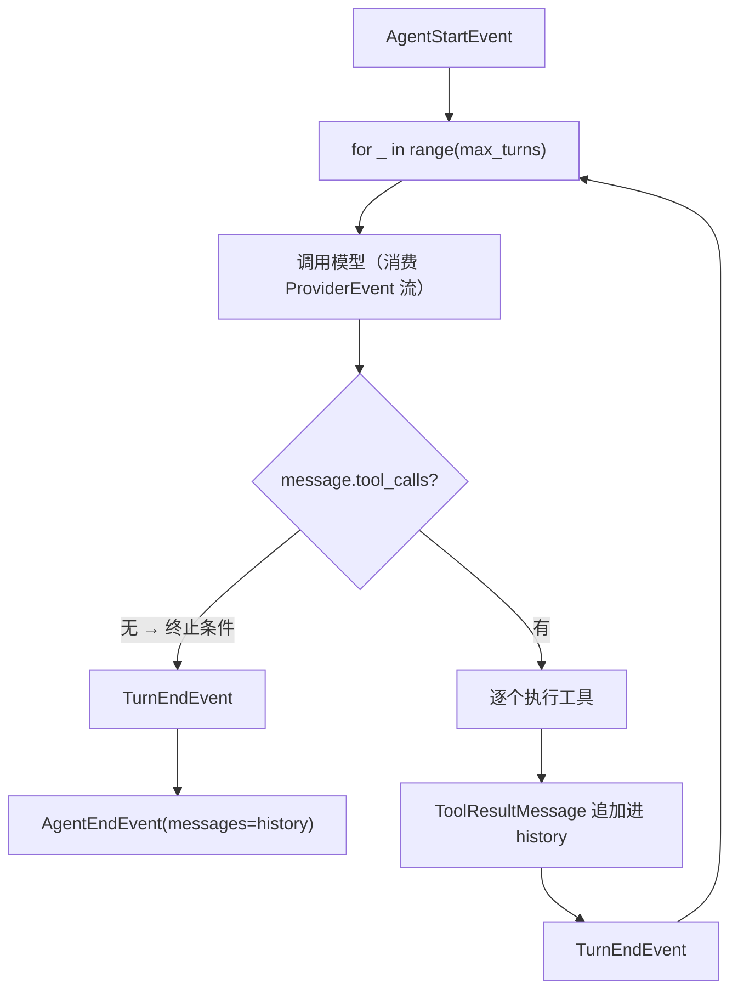
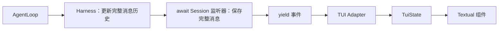
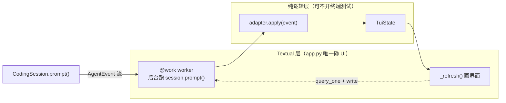
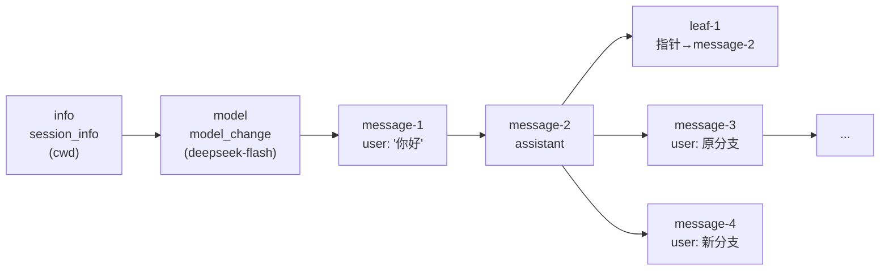

# NEXA 架构走读

> 按一次交互请求的生命周期读代码，不按目录顺序读。
> 更新：2026-10-10，完整消息由监听器逐条保存，会话树恢复当前分支。

## 一、总览：三次翻译的流水线

先看一次完整请求在三层之间怎么接力（时序图）：



整个项目只做一件事：**把用户的一句话变成 agent 的多轮行动，再把过程呈现出来**。
所有代码都在这条流水线上：

```text
用户输入 "帮我读 README"
   │
   ▼ ① 翻译成"模型语言"        nexa_ai/openai_compatible.py
ProviderEvent 流（模型正在说话：response_start / text_delta / tool_call / ...）
   │
   ▼ ② 翻译成"生命周期语言"    nexa_agent/loop.py
AgentEvent 流（agent 在干什么：turn / message / tool_execution）
   │
   ▼ ③ 翻译成"人的语言"        nexa_coding/tui/adapter.py
屏幕上的一行字、TUI 里的一条记录
```

分层归属速判法：**这个概念离开终端还能存在吗？**
能 → `nexa_agent`（核心）；必须碰网络 → `nexa_ai`；必须碰终端/磁盘/桌面 → `nexa_coding`。

依赖方向（单向，无环）：

```text
nexa_coding ──> nexa_ai ──> nexa_agent
      └─────────────────────> nexa_agent
```


图上关键读法：**没有任何箭头指向“上”**——核心层只被 import，从不 import 别的层。

## 二、入口：只有交互模式

`src/nexa_coding/cli.py`

- `parse_args()` 解析 `--provider`、`--model`、`--cwd`；无参数即可启动。
- `main()` 检查项目目录，读取供应商配置并构造 Provider，再调用 `NexaTuiApp.run()`。
- Textual 自管事件循环，入口不再使用 `asyncio.run()`。
- 用户提交输入后，TUI 的 worker 加载 `CodingSession` 并消费 `session.prompt()` 的事件。

唯一应用执行链：`CLI → TUI → CodingSession → AgentHarness → AgentLoop → Provider / 工具`。

## 三、会话：CodingSession 是项目的灵魂

`src/nexa_coding/session.py`

- `session.py` `load()` — 启动会话，**顺序是硬约束**：
  1. `session.py` 定存储：显式传入优先，否则 `NexaPaths().default_session_path(cwd)`
     （按项目隔离：`~/.nexa/sessions/<slug>-<hash8>/default.jsonl`）
  2. 读账本 → `SessionState.from_entries()` 回放历史
  3. `session.py` 资源发现：`NexaResourcePaths(cwd=cwd)`（用户 → .agents → 项目，四级优先级）
  4. 加载技能 → `session.py` 拼 system prompt（**技能必须先进 prompt，顺序不能反**）
  5. 建 harness → 塞回恢复的历史

- `session.py` `prompt()` — 展开技能，检查工具历史完整性，然后转发 Harness 事件。
- `session.py` `on_event()` — Session 本身是监听器；每条 `MessageEndEvent`
  立即保存为 `MessageEntry`，`parent_id` 指向当前分支末端。
- `session.py` `branch_to_entry()` — 写入叶子选择记录，恢复该路径的消息、模型和思考设置。
  旧分支不删除；工具调用未收齐结果的节点不允许继续。

## 四、循环：AgentLoop 是核心中的核心

`src/nexa_agent/loop.py` — 读懂这 60 行就读懂了 agent：

- `loop.py` `run()` 主循环：
  - `loop.py` `yield AgentStartEvent()`
  - `loop.py` `for _ in range(self.max_turns)` — 防 model 反复调工具死循环
  - `loop.py` 消费 `_assistant_events()`（①→②的翻译层），从 `MessageEndEvent` 取出完整助手消息
  - `loop.py` `if not message.tool_calls: break` — **循环的终止条件**：模型不再要工具
  - 否则逐个执行工具，把 `ToolResultMessage` 追加进 history，进入下一轮
  - `loop.py` `yield AgentEndEvent(messages=history)` — 带完整历史收尾

事件顺序（记住这个序列，调试时全靠它）：

```text
agent_start → turn_start → message_start → message_end
            → tool_execution_start → tool_execution_end（有工具时）
            → turn_end →（下一轮 turn_start ... 或）agent_end
```


这张图就是 `loop.py` 主循环的骨架：菱形 `loop.py` 是唯一的出口判断。

- `loop.py` `_assistant_events()` — ①→②翻译层：消费 ProviderEvent 流，
  将正文与思考的 delta 转发为 `MessageDeltaEvent`，从 `response_end` 取完整消息。
  增量用于实时显示，完整消息用于更新历史和持久化。

## 五、Harness 与订阅：一条事件流，两条消费通道

`src/nexa_agent/harness.py`

- `prompt()` 添加用户消息；`continue_()` 不加用户消息。
- `_notify()` 收到完整消息后，先更新历史，再按订阅顺序等待监听器。
- `_run_loop()` 在监听器完成后才 `yield` 给界面；监听器异常向上传递。
- 取消或关闭事件流仍会结束运行状态，已保存的完整消息保留。


监听器负责内部保存，迭代器负责实时展示；两者遵循明确的先后顺序。

## 六、Provider 实现：SSE 流怎么变成事件

`src/nexa_ai/openai_compatible.py`

- `openai_compatible.py` `stream_response()` — 实现 `nexa_agent/provider.py` 里的协议
- `openai_compatible.py` `_stream()` — HTTP SSE 逐块解析：
  - `_stream()` 累积 `text_delta`（同时攒进 buffer）
  - `_stream()` 响应结束时用攒好的内容构造 `ProviderResponseEndEvent(message=...)`
- 错误统一转成 `ProviderErrorEvent`（loop 层再转成 `错误: ...` 的助手消息）
- `nexa_ai/fake.py` — `FakeProvider` 按脚本回放事件，**全部测试都靠它，不碰网络**

## 七、呈现：TUI 消费事件流

`src/nexa_coding/tui/` 分成三层，state/adapter 不 import Textual：


测试只覆盖 `logic` 虚线框内两个模块，不需要终端——这就是分层的意义。

- `state.py` — `TuiState` 纯数据（chat_items / running / error）
- `adapter.py` `apply()` — 事件→状态翻译；`adapter.py` `_apply_one()` 用 isinstance 分派
  （delta 更新流式缓冲，message_end 提交完整消息；`AgentEndEvent` 停止 running）
- `app.py` — 唯一碰 Textual 的文件：`@work` worker 后台跑 `CodingSession.prompt()`，
  Escape 取消，UI 只画 `TuiState`

## 八、持久化：append-only 账本

`src/nexa_agent/session/`（在核心层，因为"会话"是可移植概念）

- `entries.py` — 6 种条目，`entries.py` `type Entry` 判别联合（`type` 字段）：
  `SessionInfoEntry`（:83）/ `ModelChangeEntry`（:55，只记新状态）/
  `MessageEntry`（**内嵌完整 AgentMessage**）/ `ThinkingChangeEntry` / `LabelEntry` / `LeafEntry`（当前节点指针）
- `jsonl.py` — `entry_to_line`（`exclude_none=True`）/ `entry_from_line`
  （未知 type 返回 None 容忍；坏 JSON 抛带行号的 `JsonlLineError`）。
  序列化用 `TypeAdapter(Entry)`（PEP 695 别名不能直接调 model_validate）
- `storage.py` `append()` — 永远追加模式，绝不改写；`storage.py` `read_all()` 缺文件返回 []
- `tree.py` — `path_to_entry`：沿 `parent_id` 走回根再反转（用于实际分支恢复）
- `memory.py` `from_entries()` — 回放当前分支：消息入列、model/thinking/label 覆盖；
  传 `leaf_id` 只回放根到叶路径

账本的单链结构（一次真实会话的头部）：


`leaf` 在正常运行结束或选中历史节点时追加。末条若是 leaf，就恢复其 target；
末条若是消息或设置，直接以它为当前节点。这也能恢复取消时尚未写入 leaf 的完整消息。
沿 parent_id 回到根，只回放这条路径，其他分支不会混进当前上下文。

## 九、资源与路径：四级优先级发现

- `nexa_coding/paths.py` — `NexaPaths` 唯一真相源（sessions/skills/prompts 的所有位置；
  `project_session_dir` = slug 可读名 + sha256 短哈希）
- `nexa_coding/resources.py` — `NexaResourcePaths.skills_dirs/prompts_dirs`（优先级递增）：
  ```text
  ~/.nexa  →  ~/.agents  →  <cwd>/.nexa  →  <cwd>/.agents   （后者覆盖前者）
  ```
- `nexa_coding/skills.py` — `load_skills`：跨目录同名高优先级覆盖，同目录重名抛
  `ResourceError`；`.agents` 根目录本身不当技能目录扫
- `nexa_coding/system_prompt.py` — `build_system_prompt` 确定性纯函数：
  身份 → cwd → 可选日期 → 工具 → 指南 → 技能索引 → 可选项目上下文。
  当前 CodingSession 传入 cwd、工具和技能，日期与项目上下文没有自动接入

## 十、动手实验（抓一发明全身）

1. **改 TUI 显示**：`adapter.py:_apply_one` 让工具事件显示 args 而非只显示名字
2. **加一个 Provider 事件**：`provider_events.py` 加 `ProviderUsageEvent`——体会"协议在核心"：
   加事件不用改 `openai_compatible.py` 的契约，只加实现
3. **加一种账本条目**：`entries.py` 加 `CompactionEntry`——走完
   "判别联合 → TypeAdapter 序列化 → from_entries 回放"整条链（Phase 22 预演）

## 十一、已知取舍 / 未来工作

| 事项 | 现状 | 计划 |
|---|---|---|
| 会话选择器/resume | 每项目一个 default.jsonl，自动恢复 | Phase 14 |
| 工具审批 | bash/write 直接执行 | 后续阶段 |
| 存量 mypy 错误 | demo.py / tools.py / openai_compatible.py 历史遗留 | 顺手清理 |
