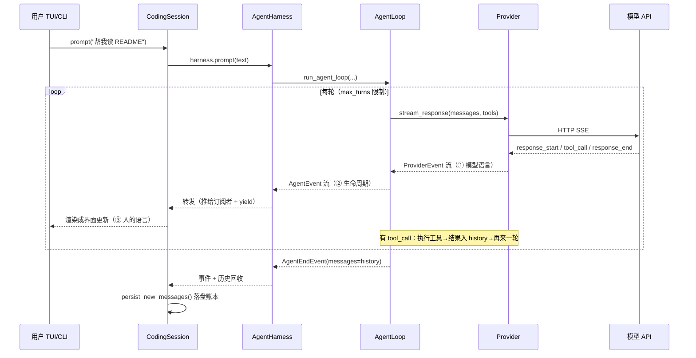
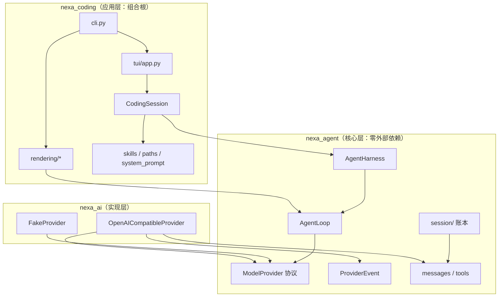
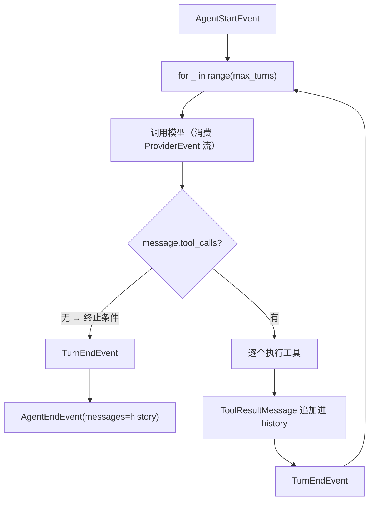
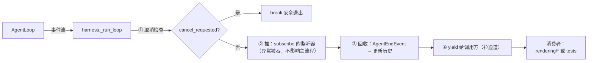
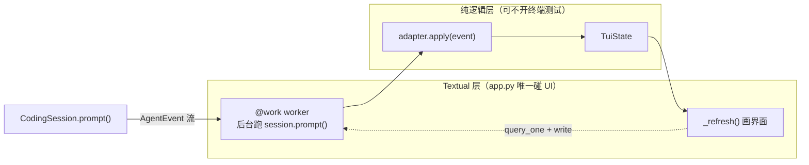
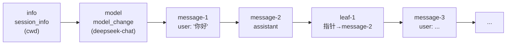

# NEXA 架构走读

> 按一次真实请求的生命周期读代码，不按目录顺序读。所有行号引用可跳转。
> 最后核对：2026-09-11（提交 27e047c）。

## 一、总览：三次翻译的流水线

先看一次完整请求在三层之间怎么接力（时序图）：



整个项目只做一件事：**把用户的一句话变成 agent 的多轮行动，再把过程呈现出来**。
所有代码都在这条流水线上：

```text
用户输入 "帮我读 README"
   │
   ▼ ① 翻译成"模型语言"        nexa_ai/openai_compatible.py
ProviderEvent 流（模型正在说话：response_start / text_delta / tool_call / ...）
   │
   ▼ ② 翻译成"生命周期语言"    nexa_agent/loop.py
AgentEvent 流（agent 在干什么：turn / message / tool_execution）
   │
   ▼ ③ 翻译成"人的语言"        nexa_coding/rendering/* 或 tui/adapter.py
屏幕上的一行字、TUI 里的一条记录
```

分层归属速判法：**这个概念离开终端还能存在吗？**
能 → `nexa_agent`（核心）；必须碰网络 → `nexa_ai`；必须碰终端/磁盘/桌面 → `nexa_coding`。

依赖方向（单向，无环）：

```text
nexa_coding ──> nexa_ai ──> nexa_agent
      └─────────────────────> nexa_agent
```


图上关键读法：**没有任何箭头指向“上”**——核心层只被 import，从不 import 别的层。

## 二、入口：两种模式分流

`src/nexa_coding/cli.py`

- `cli.py:24` `parse_args` — `-p` 可选、`--tui`、`--output`、`--model`
- `cli.py:46` 校验：非 TUI 必须给 `-p`
- `cli.py:101` `main()` — 唯一分流点：
  - `cli.py:104` `--tui` → `NexaTuiApp(...).run()`（Textual 自管事件循环，**不包 asyncio.run**）
  - 否则 → `run_prompt()`（`cli.py:65`）：裸 `AgentHarness` 跑一轮，事件喂给渲染器

> 已知取舍：print 模式还没接 `CodingSession`（不落盘），TUI 才接。两条路径并存是有意的。

## 三、会话：CodingSession 是项目的灵魂

`src/nexa_coding/session.py`

- `session.py:125` `load()` — 启动会话，**顺序是硬约束**：
  1. `session.py:134` 定存储：显式传入优先，否则 `NexaPaths().default_session_path(cwd)`
     （按项目隔离：`~/.nexa/sessions/<slug>-<hash8>/default.jsonl`）
  2. 读账本 → `SessionState.from_entries()` 回放历史
  3. `session.py:149` 资源发现：`NexaResourcePaths(cwd=cwd)`（用户 → .agents → 项目，四级优先级）
  4. 加载技能 → `session.py:148` 拼 system prompt（**技能必须先进 prompt，顺序不能反**）
  5. 建 harness → 塞回恢复的历史

- `session.py:187` `prompt()` — async generator：
  1. 记住 `before = len(messages)`
  2. `async for event in harness.prompt(text): yield event`（转发事件流）
  3. `session.py:191` 跑完后 `_persist_new_messages(before)` — **持久化在 run 完成后，
     不逐消息**（避免与 harness 内存 transcript 双重保存）

- `session.py:232` `_persist_new_messages()` — 把 `before` 之后的新消息逐条 `append`
  成 `MessageEntry`（用 `parent_id` 串成链），最后追加 `LeafEntry` 指向最新消息。

## 四、循环：AgentLoop 是核心中的核心

`src/nexa_agent/loop.py` — 读懂这 60 行就读懂了 agent：

- `loop.py:60` `run_agent_loop()` 主循环：
  - `loop.py:74` `yield AgentStartEvent()`
  - `loop.py:76` `for _ in range(self.max_turns)` — 防 model 反复调工具死循环
  - `loop.py:83` 消费 `_assistant_events()`（①→②的翻译层），从 `MessageEndEvent` 取出完整助手消息
  - `loop.py:99` `if not message.tool_calls: break` — **循环的终止条件**：模型不再要工具
  - 否则逐个执行工具，把 `ToolResultMessage` 追加进 history，进入下一轮
  - `loop.py:135` `yield AgentEndEvent(messages=history)` — 带完整历史收尾

事件顺序（记住这个序列，调试时全靠它）：

```text
agent_start → turn_start → message_start → message_end
            → tool_execution_start → tool_execution_end（有工具时）
            → turn_end →（下一轮 turn_start ... 或）agent_end
```


这张图就是 `loop.py:60` 主循环的骨架：菱形 `loop.py:99` 是唯一的出口判断。

- `loop.py:137` `_assistant_events()` — ①→②翻译层：消费 ProviderEvent 流，
  丢弃 `text_delta`（**真流式显示是未来工作**），从 `response_end` 取完整消息。

## 五、Harness 与订阅：一条事件流，两条消费通道

`src/nexa_agent/harness.py`

- `harness.py:126` `prompt()` / `harness.py:151` `continue_()` — 防并发、加用户消息（continue 不加）
- `harness.py:225` `_run_loop()` — 转发事件时做三件事：
  1. 检查取消标志（`cancel()` 设置，下一个事件检查点生效）
  2. 推送给所有订阅者（`harness.py:202` `subscribe()`，监听器异常被吞不影响主流程）
  3. `yield` 给调用方（拉通道）
- 从 `AgentEndEvent` 里回收完整历史更新 `self._messages`


同一条事件流，推（subscribe 旁路）和拉（async for）两条通道各走各的。

## 六、Provider 实现：SSE 流怎么变成事件

`src/nexa_ai/openai_compatible.py`

- `openai_compatible.py:58` `stream_response()` — 实现 `nexa_agent/provider.py` 里的协议
- `openai_compatible.py:70` `_stream()` — HTTP SSE 逐块解析：
  - `:146` 累积 `text_delta`（同时攒进 buffer）
  - `:192` 响应结束时用攒好的内容构造 `ProviderResponseEndEvent(message=...)`
- 错误统一转成 `ProviderErrorEvent`（loop 层再转成 `错误: ...` 的助手消息）
- `nexa_ai/fake.py` — `FakeProvider` 按脚本回放事件，**全部测试都靠它，不碰网络**

## 七、呈现：同一事件流的三种消费者

**print 模式**（`src/nexa_coding/rendering/`）：

- `base.py` — `EventRenderer` 协议：`render(event)` + `finish() -> bool`（退出码来源）
- `plain.py:26` — 只抓 `AgentEndEvent` 的最终答案；失败诊断进 stderr，stdout 保持干净
- `json.py` — 每个事件一行 JSON
- `transcript.py` — 工具过程 → stderr，答案 → stdout；工具失败影响 `finish()`

**TUI**（`src/nexa_coding/tui/`，三层分工，红线是 state/adapter 不 import Textual）：


测试只覆盖 `logic` 虚线框内两个模块，不需要终端——这就是分层的意义。

- `state.py` — `TuiState` 纯数据（chat_items / running / error）
- `adapter.py:29` `apply()` — 事件→状态翻译；`adapter.py:42` `_apply_one()` 用 isinstance 分派
  （注意：**成对 start/end 合并整条消息**，`AgentEndEvent` 只停 running 不反查）
- `app.py` — 唯一碰 Textual 的文件：`@work` worker 后台跑 `CodingSession.prompt()`，
  Escape 取消，UI 只画 `TuiState`

## 八、持久化：append-only 账本

`src/nexa_agent/session/`（在核心层，因为"会话"是可移植概念）

- `entries.py` — 5 种条目，`entries.py:113` `type Entry` 判别联合（`type` 字段）：
  `SessionInfoEntry`（:83）/ `ModelChangeEntry`（:55，只记新状态）/
  `MessageEntry`（:39，**内嵌完整 AgentMessage**）/ `LabelEntry`（:72）/ `LeafEntry`（:97，指针）
- `jsonl.py` — `entry_to_line`（`exclude_none=True`）/ `entry_from_line`
  （未知 type 返回 None 容忍；坏 JSON 抛带行号的 `JsonlLineError`）。
  序列化用 `TypeAdapter(Entry)`（PEP 695 别名不能直接调 model_validate）
- `storage.py:33` `append()` — 永远追加模式，绝不改写；`storage.py:47` `read_all()` 缺文件返回 []
- `tree.py` — `path_to_entry`：沿 `parent_id` 走回根再反转（为将来分支预留）
- `memory.py:35` `from_entries()` — 回放：消息入列、model/label 覆盖；
  传 `leaf_id` 只回放根到叶路径

账本的单链结构（一次真实会话的头部）：


`leaf` 每轮对话追加一条，指向最新消息——恢复会话时直接找最后的 leaf，
不用从根走到底；`parent_id` 串链则为将来的分支预留了树结构。

## 九、资源与路径：四级优先级发现

- `nexa_coding/paths.py` — `NexaPaths` 唯一真相源（sessions/skills/prompts 的所有位置；
  `project_session_dir` = slug 可读名 + sha256 短哈希）
- `nexa_coding/resources.py` — `NexaResourcePaths.skills_dirs/prompts_dirs`（优先级递增）：
  ```text
  ~/.nexa  →  ~/.agents  →  <cwd>/.nexa  →  <cwd>/.agents   （后者覆盖前者）
  ```
- `nexa_coding/skills.py` — `load_skills`：跨目录同名高优先级覆盖，同目录重名抛
  `ResourceError`；`.agents` 根目录本身不当技能目录扫
- `nexa_coding/system_prompt.py` — `build_system_prompt` 确定性纯函数：
  身份 → cwd → 日期 → 工具 → 指南 → 技能索引（只放 location，模型自己 read）→ 项目上下文

## 十、动手实验（抓一发明全身）

1. **改 TUI 显示**：`adapter.py:_apply_one` 让工具事件显示 args 而非只显示名字
2. **加一个 Provider 事件**：`provider_events.py` 加 `ProviderUsageEvent`——体会"协议在核心"：
   加事件不用改 `openai_compatible.py` 的契约，只加实现
3. **加一种账本条目**：`entries.py` 加 `CompactionEntry`——走完
   "判别联合 → TypeAdapter 序列化 → from_entries 回放"整条链（Phase 22 预演）

## 十一、已知取舍 / 未来工作

| 事项 | 现状 | 计划 |
|---|---|---|
| 真流式显示 | `text_delta` 在翻译层被丢弃 | 给 nexa_agent 加 delta 事件 |
| print 模式落盘 | 用裸 harness，不接 CodingSession | 统一两条路径 |
| 会话选择器/resume | 每项目一个 default.jsonl，自动恢复 | Phase 14 |
| 工具审批 | bash/write 直接执行 | 后续阶段 |
| 存量 mypy 错误 | demo.py / tools.py / openai_compatible.py 历史遗留 | 顺手清理 |
